### 1. hostname指令

作用：操作服务器的**主机名**（**读取**、设置）

语法1：#hostname      

含义：表示输出完整的主机名

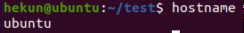

语法2：#hostname -f    

含义：表示输出当前主机名中的FQDN（全限定域名）

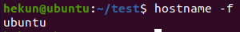

### 2. id指令

作用：查看一个用户的一些基本信息（包含用户id，用户组id，附加组id…），该指令如果不指定用户则默认当前用户。

语法1：#id    默认显示当前执行该命令的用户的基本信息

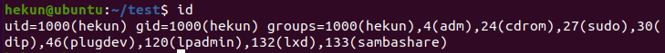

语法2：#id  用户名     显示指定用户的基本信息

验证上述信息是否正确？

**验证用户信息：cat/etc/passwd**

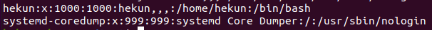

**验证用户组信息：cat /etc/group**

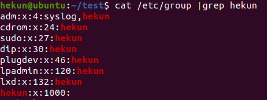

### 3. whoami指令

作用：“我是谁？”显示当前登录的用户名，一般用于shell脚本，用于获取当前操作的用户名方便记录日志。

语法：#whoami

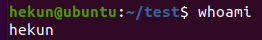

### 4. ps -ef指令（重点）

指令：ps  

作用：主要是查看服务器的进程信息

选项含义：

-e：等价于“-A”，表示列出全部的进程

-f：显示全部的列（显示全字段）

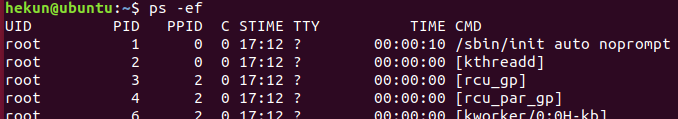

列的含义：

UID：该进程执行的用户id；

PID：进程id；

PPID：该进程的父级进程id，如果一个程序的父级进程找不到，该程序的进程称之为僵尸进程（parent process ID）；

C：Cpu的占用率，其形式是百分数；

STIME：进行的启动时间；

TTY：终端设备，发起该进程的设备识别符号，如果显示“?”则表示该进程并不是由终端设备发起；

TIME：进程的执行时间；

CMD：该进程的名称或者对应的路径；

 

案例：（100%使用的命令）在ps的结果中过滤出想要查看的进程状态

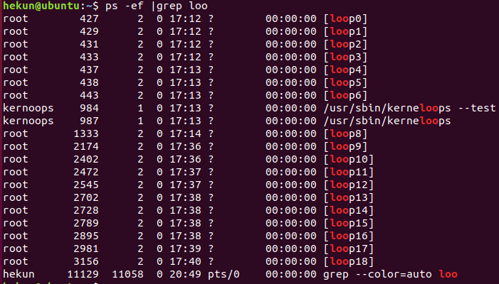

#ps -ef|grep “进程名称"

### 5. top指令（重点）

**作用：查看服务器的进程占的资源（****100%****使用）**

语法：

进入命令：#top      （动态显示）

退出命令：按下q键

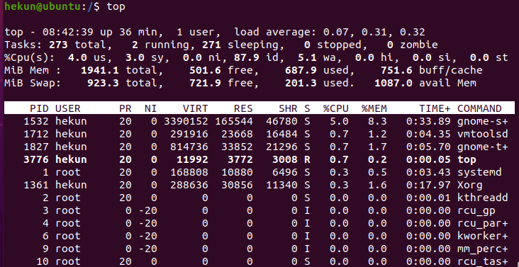

表头含义：

PID：进程id；

USER：该进程对应的用户；

PR：优先级；

VIRT：虚拟内存；

RES：常驻内存；

SHR：共享内存；

计算一个进程实际使用的内存 = 常驻内存（RES）- 共享内存（SHR）

S：表示进程的状态status（sleeping，其中S表示睡眠，R表示运行）；

%CPU：表示CPU的占用百分比；

%MEM：表示内存的占用百分比；

TIME+：执行的时间；

COMMAND：进程的名称或者路径；

 

**在运行top的时候，可以按下方便的快捷键：**

M：表示将结果按照内存（MEM）从高到低进行降序排列；

P：表示将结果按照CPU使用率从高到低进行降序排列；

1：当服务器拥有多个cpu的时候可以使用“1”快捷键来切换是否展示显示各个cpu的详细信息；

###  6. du -sh指令

作用：查看目录的真实大小

**语法：#du -sh 目录路径**

选项含义：

-s：summaries，只显示汇总的大小

-h：表示以高可读性的形式进行显示

### 7.  find指令

作用：用于查找文件（其参数有55个之多）

语法：#**find** **路径范围 选项 选项的值**

选项：

-name：按照文档名称进行搜索（支持模糊搜索）

-type：按照文档的类型进行搜索

**文档类型：“-”表示文件（在使用find的时候需要用f来替换），“d”表示文件夹**

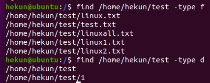

案例：搜索etc目录下所有的conf后缀文件

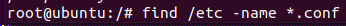

###  8. service指令（重点）

作用：用于控制一些软件的服务启动/停止/重启

**语法：****#service** **服务名** **start/stop/restart**

###  9. kill指令（重点）

**作用：表示杀死进程**     （当遇到僵尸进程或者出于某些原因需要关闭进程的时候）

语法：**#kill** **进程****PID**    （语法需要配合ps一起使用）

与kill命令作用相似但是比kill更加好用的杀死进程的命令：killall

语法：**#killall** **进程名称**

 

### 10. ifconfig指令（重点）

**作用：用于操作网卡相关的指令。**

简单语法：#ifconfig    （获取网卡信息）

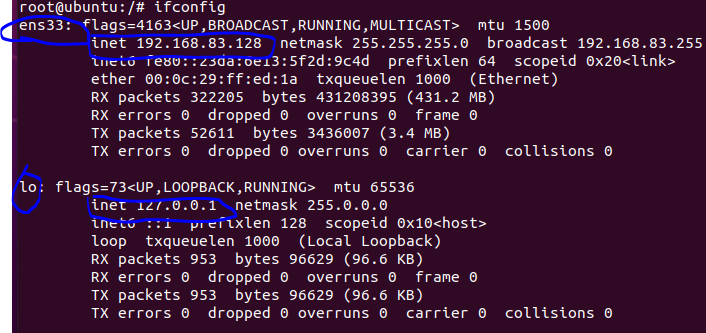

ens33表示Linux中的一个网卡，ens33是其名称。Lo（**loop****，本地回还网卡，其****ip****地址一般都是****127.0.0.1**）也是一个网卡名称。

**注意：****inet** **就是网卡的****ip****地址**。

###  11. reboot指令

作用：重新启动计算机    

语法1：#reboot    **重启**

语法2：#reboot  -w  模拟重启，但是不重启（只写关机与开机的日志信息）

###  12. shutdown指令

作用：关机      （慎用）

**语法1：#shutdown -h now  “关机提示”** 

**或者**

 **#shutdown  -h 15:25 “关机提示”**

案例：设置Linux系统关机时间在12:00

 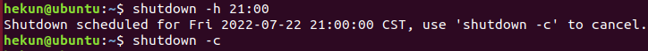

**除了shutdown关机以外，还有以下几个关机命令：**

**#init 0**

**#halt**

**#poweroff**

### 13. uptime指令

作用：输出计算机的持续在线时间（**计算机从开机到现在运行的时间**）

**语法：#uptime**

### 14. uname指令

作用：获取计算机操作系统相关信息

语法1：#uname            获取操作系统的类型

**语法2****：#uname -a       all****，表示获取全部的系统信息（类型、全部主机名、内核版本、发布时间、开源计划）**

### 15. netstat -tnlp指令

作用：查看网络连接状态

语法：#netstat -tnlp

选项说明：

​    -t：表示只列出tcp协议的连接；

​    -n：表示将地址从字母组合转化成ip地址，将协议转化成端口号来显示；

​    -l：表示过滤出“state（状态）”列中其值为LISTEN（监听）的连接；

​    -p：表示显示发起连接的进程pid和进程名称；

###  16. man指令

作用：manual，手册（包含了Linux中全部命令手册，英文）

语法：#man 命令          （退出按下q键）

 案例：通过man命令查询cp指令的用法

\#man cp

