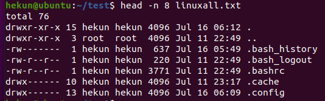
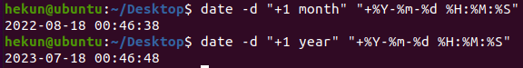

### 1. df指令

作用：查看磁盘的空间

**语法：#df -h**   

**-h**   **表示以可读性较高的形式展示大小**

###  2. free

作用：查看内存使用情况

**语法：**  **#free -m  -m** **表示以** **mb** **为单位查看 ** **-g表示以gb为单位查看**

Swap：用于临时内存，当系统真实内存不够用的时候可以临时使用磁盘空间来充当内存。

### 3. head

作用：查看一个文件的前n行，如果不指定n，则默认显示前10行。

**语法：** **#head -n** **文件路径**  **【n表示数字】**

### 4. tail

作用1：查看一个文件的未n行，如果n不指定默认显示后10行

**语法：****#tail -n** **文件的路径**   **n****同样表示数字**

作用2：可以通过tail指令来查看一个文件的动态变化内容【**变化的内容不能是用户手动增加的**】

**语法：#tail -f 文件路径**

**利用输出重定向功能，将内容写入指定文件**

**该命令一般用于查看系统的日志比较多。**

### 5. less指令

作用：查看文件，以较少的内容进行输出，按下辅助功能键（数字+回车、**空格键**+上下方向键）查看更多

**语法：#less** **需要查看的文件路径**

在退出的只需要按下q键即可。

### 6. wc指令

作用：统计文件内容信息（包含行数、单词数、字节数）

语法：**#wc -lwc** **需要统计的文件路径**

**-l：表示lines，行数**

-w：表示words，单词数  依照空格来判断单词数量

-c：表示bytes，字节数

### 7. date指令（重点）

作用：表示操作时间日期（**读取**、设置）

语法1：#date   

语法2：**#date +%F**  **（等价于** **#date “+%Y-%m-%d”** **）** 

语法3：#date  “+%F %T”  **引号表示让“年月日与时分秒”成为一个不可分割的整体**

**等价操作 #date “+%Y-%m-%d %H:%M:%S”**

语法4：获取之前或者之后的某个时间（备份）

\#date -d “**-**1 **day**”   “+%Y-%m-%d %H:%M:%S”

符号的可选值：+（之后） 或者 - （之前）

单位的可选值：day（天）、month（月份）、year（年）

**%F：表示完整的年月日**

**%T：表示完整的时分秒**

**%Y：表示四位年份**

**%m：表示两位月份（带前导0）**

**%d：表示日期（带前导0）**

**%H：表示小时（带前导0）**

**%M：表示分钟（带前导0）**

**%S：表示秒数（带前导0）**

### 8. cal

**作用：用来操作日历的**

**语法1：#cal  **等价于** **#cal -1**     直接输出当前月份的日历

**语法2：#cal -3      表示输出上一个月+本月+下个月的日历**

**语法3：#cal -y 年份      表示输出某一个年份的日历**

### 9. clear / ctrl+L指令

作用：清除终端中已经存在的命令和结果（信息）。

**语法：clear**    **或者快捷键：ctrl + L**

### 10. 管道（重要）

**管道符：****|**

作用：管道一般可以用于“**过滤**”，“特殊”，“扩展处理”。

语法：管道不能单独使用，必须需要配合前面所讲的一些指令来一起使用，其作用**主要是辅助作用**。

(1)过滤：需要通过管道查询出根目录下包含“y”字母的文档名称。

**针对上面这个命令说明：**

**①以管道作为分界线，前面的命令有个输出，后面需要先输入，然后再过滤，最后再输出，通俗的讲就是管道前面的输出就是后面指令的输入；**

**②grep指令：主要用于过滤**

(2)特殊：通过管道的操作方法来实现less的等价效果（了解）

之前通过less查看一个文件，可以#less 路径

现在通过管道还可以这么：#cat 路径|less

③扩展处理：请使用学过的命令，来统计某个目录下的文档的总个数？

**答：****#ls / | wc -l**

