### 1. Linux目录结构和作用

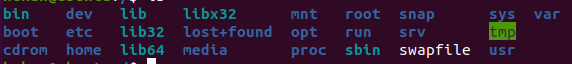

 Bin：全称binary，含义是二进制。该目录中存储的都是一些二进制文件，文件都是可以被运行的。

Dev：该目录中主要存放的是外接设备，例如盘、其他的光盘等。在其中的外接设备是不能直接被使用的，需要**挂载（类似****windows****下的分配盘符）**。

Etc：该目录主要存储一些配置文件。

Home：表示“家”，表示**除了****root****用户以外其他用户的家目录**，类似于windows下的User/用户目录。

Proc：process，表示进程，该目录中存储的是Linux运行时候的进程。

Root：该目录是root用户自己的家目录。

Sbin：全称super binary，该目录也是存储一些可以被执行的二进制文件，但是必须得有super权限的用户才能执行。

Tmp：表示“临时”的，当系统运行时候产生的临时文件会在这个目录存着。

Usr：存放的是用户自己安装的软件。类似于windows下的program files。

Var：存放的程序/系统的日志文件的目录。

Mnt：当外接设备需要挂载的时候，就需要挂载到mnt目录下。

### 2. 命令ls

含义：ls （list）

 **(1)用法1：#ls**

含义：列出当前工作目录下的所有文件/文件夹的名称

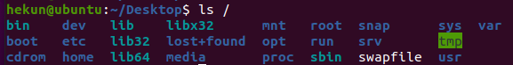

 **(2)用法2：#ls 路径**

含义：列出指定路径下的所有文件/文件夹的名称

**关于路径（重要）：**

**路径可以分为两种：相对路径、绝对路径。**

**相对路径：相对首先得有一个参照物（一般就是当前的工作路径）；**

**相对路径的写法：在相对路径中通常会用到2个符号“  ./ ”【表示当前目录下】、“../”【上一级目录下】。**

**绝对路径：绝对路径不需要参照物，直接从根“/”开始寻找对应路径；**

 **(3)ls** **选项 路径**

含义：在列出指定路径下的文件/文件夹的名称，并以指定的格式进行显示。

常见的语法：#ls -l 路径           #ls -la 路径

选项解释：

**-l：表示list，表示以详细列表的形式进行展示**

**-a：表示显示所有的文件/文件夹（包含了隐藏文件/文件夹）**

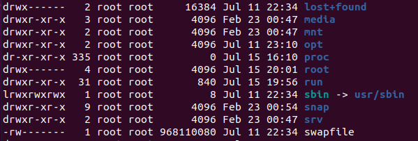

**上述列表中的第一列字符表示文档的类型，其中“-”表示改行对应的文档类型为文件，“d”表示文档类型为文件夹。**

**在Linux中隐藏文档一般都是以“.”开头。**

 

**(4)用法4：#ls -lh路径**

含义：列出指定路径下的所有文件/文件夹的名称，以列表的形式并且在显示文档大小的时候以**可读性较高的形式显示**

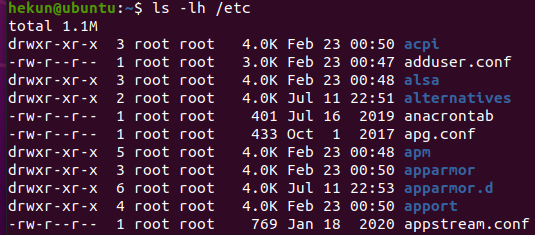

 **在Linux中有一个特殊的符号“~”，表示当前用户的家目录。**

 

### 3. mkdir指令

指令：mkdir  （make directory，创建目录）

语法1：**#mkdir** **路径 【路径，可以是文件夹名称也可以是包含名称的一个完整路径】**

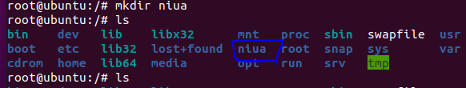

注意：ls列出的结果颜色说明，**其中蓝色的名称表示文件夹**，黑色的表示文件，**绿色的其权限为拥有所有权限**。

语法2：**#mkdir -p** **路径**

含义：**当一次性创建多层不存在的目录的时候**，添加-p参数，否则会报错

 语法3：**#mkdir** **路径1 路径2 路径3 ….** 【表示一次性创建多个目录】

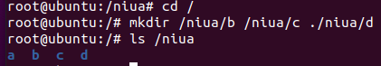

### 4. touch指令

指令：touch  

作用：创建文件

语法：**#touch** **文件路径**  【路径可以是直接的文件名也可以是路径】

 (1)使用touch来在当前路径下创建一个文件，命名为Linux.txt

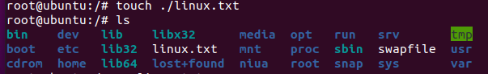

 (2)使用touch来同时创建多个文件

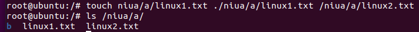

 (3)使用touch来在“hekun”用户的家目录中创建文件，Linux.txt

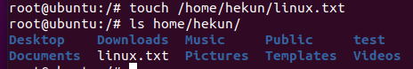

### 5. 指令：cp （copy，复制）

作用：复制文件/文件夹 到 指定的位置

语法：**#cp** **被复制的文档路径** **文档被复制到的路径**

(1)使用cp命令来复制一个文件

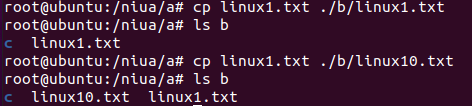

**注意：Linux在复制过程中是可以重新对新位置的文件进行重命名的，但是如果不是必须的需要，则建议保持前后名称一致。**

(2)使用cp命令来复制一个文件夹

**注意：当使用cp命令进行文件夹复制操作的时候需要添加选项“-r”【-r表示递归复制】，否则目录将被忽略**

### 6. 指令：mv （move，移动，剪切）

作用：移动文档到新的位置

语法：**#mv** **需要移动的文档路径 需要保存的位置路径**

确认：移动之后原始的文件还在不在原来的位置？**原始文件是不在原始位置的**

(1)使用mv命令移动一个文件

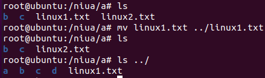

(2)使用mv命令移动一个文件夹

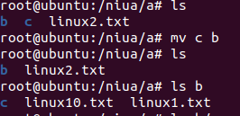

 **补充：在Linux中重命名的命令也是mv，语法和移动语法一样。**

### 7. rm指令

指令：rm （remove，移除、删除）

作用：移除/删除文档

语法：#rm 选项 需要移除的文档路径

选项： -f：force，强制删除，不提示是否删除

​			-r：表示递归

(1)删除一个文件

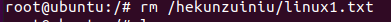

在删除的时候如果不带选项，会提示是否删除，如果需要确认则输入“y/yes”，否则输入“n/no”按下回车。

**注意：如果在删除的时候不想频繁的确认，则可以在指令中添加选项“-f”，表示force（强制）。**

(2)删除一个文件夹

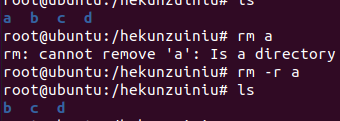

 (3)删除多个文档

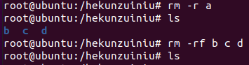

 (4)删除一个目录下有公共特性的文档，例如都以Linux开头

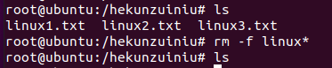

**其中，*称之为通配符，意思表示任意的字符，Linux\*，则表示只要文件以Linux开头，后续字符则不管**。     

### 8. 输出重定向

**一般命令的输出都会显示在终端中，有些时候需要将一些命令的执行结果想要保存到文件中进行后续的分析****/****统**   **计，则这时候需要使用到的输出重定向技术。**

 \>：覆盖输出，会覆盖掉原先的文件内容

\>>：追加输出，不会覆盖原始文件内容，会在原始内容末尾继续添加

 **语法：****#****正常执行的指令** **> / >>** **文件的路径**

注意：文件可以不存在，不存在则新建

 (1)使用覆盖重定向，保存ls -la 的执行结果，保存到当前目录下的ls.txt

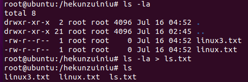

 

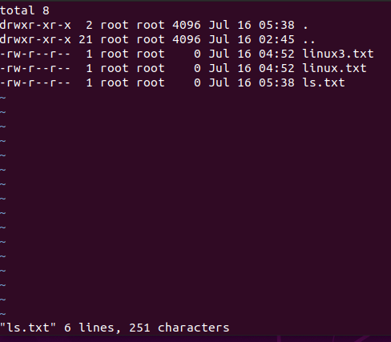

(2)使用追加重定向，保存ls -la的执行结果到ls.txt中

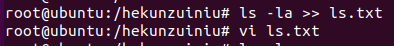

 

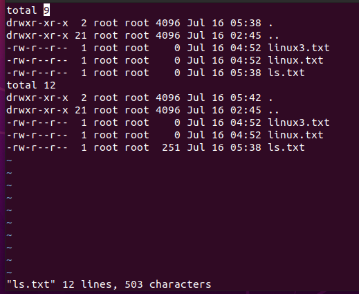

1. cat指令

 

**作用****1****：****cat****有直接打开一个文件的功能，查看内容直接输出到控制台，不用退出**

**语法****1****：****#cat** **文件的路径**

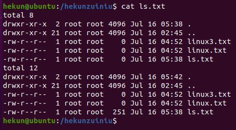

 

**作用****2****：****cat****还可以对文件进行合并**

**语法****2****：****#cat** **待合并的文件路径****1** **待合并的文件路径****2 ….** **文件路径****n >** **合并之后的文件路径**

 

(1)合并3个文件，并存到一个文件中【配合输出重定向使用】

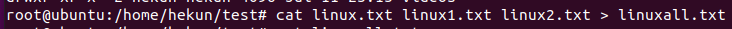

 

 